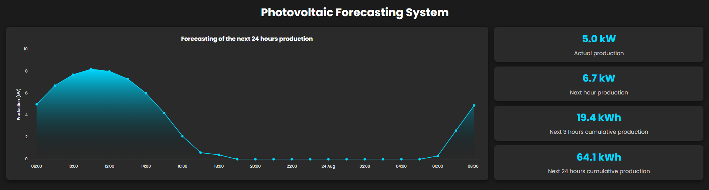

# Forecasting photovoltaic production
A simple and intuitive Flask application for forecasting photovoltaic production from 1 to 14 days ahead. It uses the _pvlib_ library to model the photovoltaic system with few parameters and _open-meteo API_ to obtain the forecasts.



### Project configuration

- Clone the project from the repository:
    ```bash
  git clone https://github.com/Giudice7/pv_forecast
    ```

- Open the terminal and move to the project folder.
    ```bash
  cd pv_forecast
    ```

- Check the python version installed:
    ```bash
  python --version
    ```

    In this project, Python 3.11 was used, so it is recommended to use the same version to avoid compilation problems. If you have a different version, download the 3.11 from the following [link](https://www.python.org/downloads/release/python-3110/).

- Create a virtual environment (venv) in the project folder:
    ```bash
    python -m venv venv
    ```
- Activate the virtual environment:
    ```bash
    venv/Scripts/activate
    ```
- Install dependencies:
    ```bash
    pip install -r requirements.txt
    ```

- Run the application:
    ```bash
    python app.py
    ```

- Open the browser and go to the following address:
    ```bash
  http://127.0.0.1:5000
  ```
  
### Adapt to your PV system

- Open the file `config.json` and change the parameters of the photovoltaic system to match your system. The parameters are:
    - `latitude`: Latitude of the location in decimal degrees.
    - `longitude`: Longitude of the location in decimal degrees.
    - `forecasting_days`: Number of days to forecast.
    - `pdc0_inverter`: Nominal power of the inverter in W.
    - `array_list`: The list of arrays that compose the whole PV system.
  
Each array has the following parameters:
  - `surface_tilt`: The tilt angle of the panels.
  - `surface_azimuth`: The azimuth angle of the panels.
  - `module_type`: The module materials sandwich: can be one of _polymer_glass_ or _glass_glass_.
  - `pdc0_module`: The nominal power of each module.
  - `gamma_pdc_module`: The loss coefficient due to temperature increase of the module (from - 0.002 to -0.005 typically)
  - `module_per_string`: The number of module per each string.
  - `strings`: The number of strings in the array.

### Running in docker

- Build the image:
    ```bash
    docker build -t pv_forecast .
    ```

- Run the container:
    ```bash
    docker run -p 5000:5000 pv_forecast
    ```
- Open the browser and go to the following address:
    ```bash
    http://localhost:5000
    ```

### References

1. [pvlib-python](https://pvlib-python.readthedocs.io/en/stable/index.html)
2. [open-meteo API](https://open-meteo.com/)